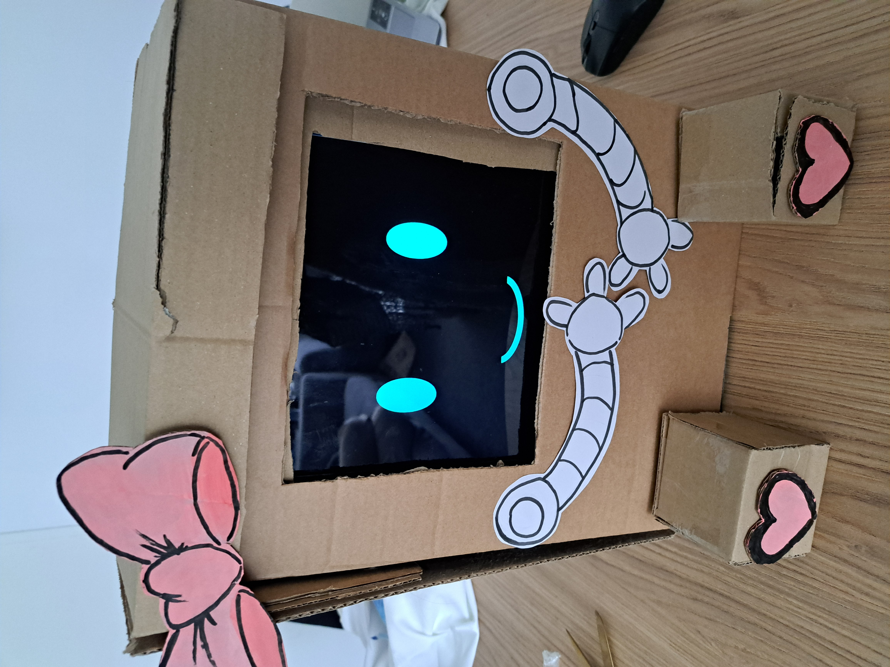

Ik had gekozen voor dit project omdat ik al eerder heb gewerkt aan een robot project waar ik uiteindelijk nooit de kans voor kreeg om het helemaal uit te werken. Als gamedev student heb ik ook vaker ervaring met wilde ideeën van opdracht gevers en ik vind het altijd een leuke uitdaging om een goed project neer te zetten wat aan deze wilde verwachtingen voldoet. 

## Dark side

We zijn met het project begonnen met veel onderzoek doen zodat we weten wat de donkere kant van sociale robotica is. Ik zelf dit onderzoek naar biases, zowel onbewuste bias in de software maar ook assumpties die ontwerpers maken die voor problemen kunnen zorgen. Mijn conclusie was dat omdat we met een brede doelgroep werken we met veel onbewuste biases te maken hebben. Het plan om meerdere prototypes te maken die meer passen bij bepaalde doelgroepen kan ervoor zorgen dat er meer aannames gemaakt worden in onze designs. Keuzes die we maken om meer contact te maken met een specifieke doelgroep moeten daarom goed onderbouwd worden en het liefste vanuit de doelgroep zelf komen. Zolang we aannames testen, niet ervan uit gaan dat de biases die we hebben correct zijn en testen met een brede doelgroep kunnen we voorkomen dat biases een probleem zijn voor de prototypes.

Omdat er problemen waren met het regelen van de robot was er de mogelijkheid om zelf een robot in elkaar te zetten. Ik vond dat eigenlijk een hele mooie mogelijkheid om te experimenteren op het uiterlijk van de robot. Voortbouwend op mijn onderzoek werkte ik aan een vriendelijke robot die vooral voor jonge meisjes leuk zou moeten zijn. Toen we ons onderzoek voorlegde aan de project owners kwamen zij met hun data voor bepaalde doelgroepen. Zij zeiden dat jonge kinderen in het specifiek makkelijk met de robot praten dus toen wij opzoek waren naar een specifieke doelgroep voor onze dark side prototype was gauw de keuze gemaakt. Hierbij negeerde ik het advies van mijn onderzoek en maakte ik juist erg meisjes achtige accesoires erbij.  

## Lightside

Sprint 3 waren we al begonnen met de light side prototype, we konden met de NAO werken en aangezien we ook in Diemen gaan staan met onze prototype is het belangrijk dat we iets kunnen neerzetten waarvan we weten dat het werkt.
Toen we begonnen met de robot hadden we eerst een gesprek gemaakt waarbij de robot feitjes deelt over verschillende landen gebasseert op het onderzoek van teamgenoten. Ik had al eerder met een softbanks robot gewerkt maar niet meer sinds het bedrijf failiet is gegaan. Ik wist dat de robot nederlands kan spreken en zorgde ervoor dat dit als eerste opgezet wordt maar zonder deze kennis zou je er makkelijk vanuit kunnen gaan dat het niet mogelijk is. We hebben iteratief het gesprek steeds meer uitgebreid en kwamen al veel problemen tegen maar ook veel oplossingen. De demo met opdrachtgevers ging heel goed maar uit de feedback van de gebruikerstesten die we hadden gedaan bleek dat er wat interactie ontbreekt.

Dus gingen wij aan de slag met een nieuwe prototype waarbij de mens wat meer in te brengen heeft. Daarnaast wouden we ook iets wat op meerdere doelgroepen aansluit en beter gebruik maakt van de robot. Uiteindelijke hadden we een hitster-achtig spel waar de robot een liedje afspeelt en erbij danst waar de speler moest zeggen uit welk land deze komen. Ik heb zelf veel gewerkt aan het programma om ervoor te zorgen dat de spraak herkenning goed werkt. Sommige woorden zijn moeilijk te herkennen, we hadden vooral veel problemen met het woord "Spanje" wat wel jammer is want ik had zelf de macarena initieel in elkaar gezet om de timing van de robot op de muziek te testen. We hebben veel gebruikers testen gedaan met namen om die spraakherkenning goed in beeld te krijgen want een te hoge of te lage stem kan minder goed verstaan worden. Er zit dus veel bias in de software van de robot dus zelfs in onze light prototype komen de onderwerpen van de darkside onderzoek naar boven. Gelukkig met wat ervaring waar het mis gaat tijdens testen wisten we hoe we eromheen kunnen werken.
Het maken van de dansjes waarbij een persoon de pose vasthield van de robot en de ander de waarde opslaat in het programma koste veel moeite maar zorgde voor soepele en vaak herkenbare dansjes. Het maken van de grote quiz door het samenvoegen van alle dansjes zorgde ook voor de nodige bugs maar uiteindelijk was er een leuk spel. 

Op de expo hadden we twee tafels opgezet met daarop onze dark side prototype en light side prototype. In eerdere testen zijn we er al achter gekomen dat beide projecten niet altijd soepel lopen. De dark side robot kan soms even duren met een antwoord genereren maar dat geeft wel de tijd om de problemen en dilemmas van de robot met de bezoeker te bespreken. De light side robot kan niet altijd alles goed verstaan en kan soms problemen tegen komen die ervoor zorgen dat de robot gereboot moet worden. Doordat we twee tafels hadden dachten we makkelijk problemen van de ene robot op te vangen door ze naar de andere door te sturen. Op de middag zelf hadden we vaak 2 groepen voor ons staan waarbij de dansjes van de NAO voor afleiding zorgde terwijl er op een antwoord van de dark side chatbot werd gewacht. We hebben veel geleerd van vorige tests met de NAO en veel problemen konden soepel worden opgevangen ondanks de niet ideale omstandigheden op de drukke expo. Bij de dark side robot werd er ook door bezoekers gekeken of er problemen konden worden veroorzaakt wat voor interessante gesprekken zorgde maar ook als het over onschuldige ijsjes ging kon de chatbot appart reageren en liet goed de risico's zien van AI gebruik. Mensen willen graag mee praten over AI en wat ze daar van vinden dus hadden we vaak goeie gesprekken bij de dark side robot.

De meeste mensen die wij hebben gesproken op de expo waren erg enthousiast en wouden graag dingen uit proberen en meer weten over onze robots. Er was veel interactie tussen mensen bij het muziek spel wat voor ons het belangrijkste doel is. Je had mensen die hun best deden om de quiz goed te doen maar als iemand niet het antwoord wist wouden andere mensen graag inspringen met wat zij dachten wat correct was zelfs als het apparte groepen waren. De opstelling die we hadden zorgde er wel voor dat het moeilijk was om op te splitsen. De light side robot had echt iemand nodig om bij te houden of de robot alles wel goed verstond. Vaak deed deze dan ook de begeleiding van het spel en ook hints geven naar het goeie antwoord. Voor onze eigen gemaakte robot waren er vaak 2 personen nodig om de vragen over het uiterlijk en over de chatbot te beantwoorden. Vaak waren er specifieke vragen waarbij niet iedereen van het team antwoord erop heeft zonder wat creatieve invulling.

## Mijn rol hierin

Ik heb tijdens dit project veel in mijn comfort zone gezeten en vooral veel ideeën ontworpen op basis van onderzoek en feedback van de opdrachtgevers en gebruikers testen. Het verbaaste me een beetje dat ik tijdens onze afrondende feedback complimenten kreeg voor het opnemen van verantwoordelijkheden en het aansturen van de groep. Tijdens brainstorm sessies neem ik wel de leiding en ik ben inmiddels een manier van retrospectives gewent dus zet ik die op. Dit zorgde er voor dat ik onbewust toch veel dingen heb gedaan buiten wat ik wil doen.

Ik had graag nog wat meer ideeën uitgewerkt maar ik denk dat we het heel goed hebben gedaan. 
